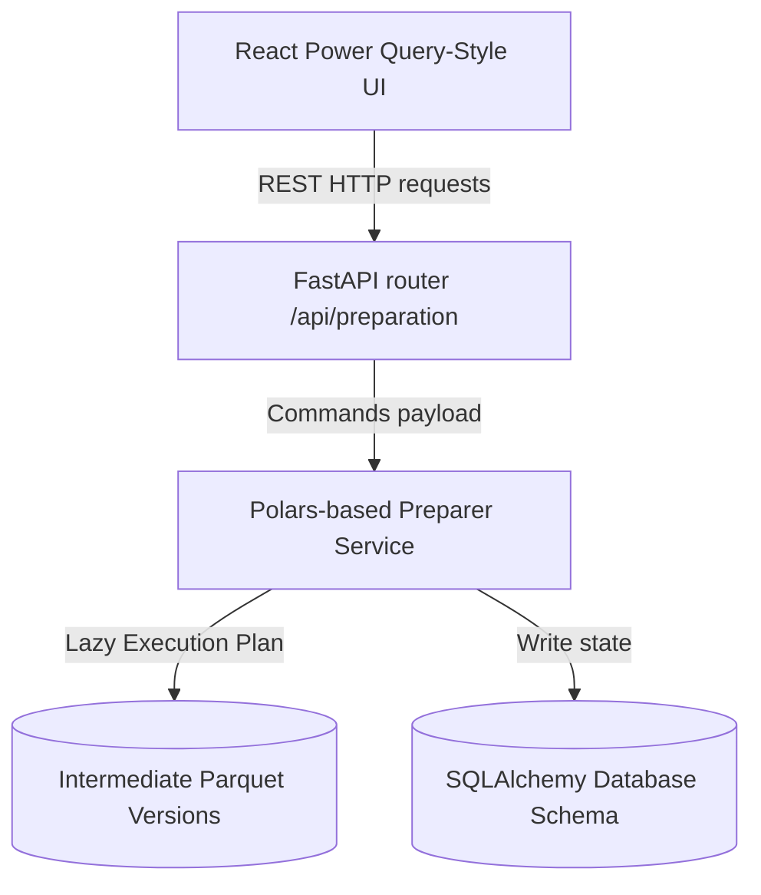

# Architecture Design — Intelligent Data Preparation Studio

This document explains the high-level design and architectural components of the **Intelligent Data Preparation Studio** inside DataSaaS Pro.

---

## 1. High-Level Architectural Layers

The Data Preparation Studio is structured into three main decoupled layers:

### A. Frontend Layer (React 19)
Provides an interactive studio interface mimicking Microsoft Power Query:
* Left panel lists chronological versions (v1, v2, v3, v4).
* Center panel displays active preview of the selected dataset version.
* Right panel displays custom setting inputs matching the active operation.
* Bottom panel renders the step-by-step history chain with undo/redo capabilities.

### B. Route & Control Layer (FastAPI)
Exposes endpoints to receive configuration payloads, query previous pipeline runs, increment/decrement pointers, and stream exports in multiple formats.

### C. Engine Layer (Polars Lazy Execution)
Performs memory-efficient dataset transformation. Using `polars.LazyFrame`, operations are queued and executed in a single compilation plan. Results are streamingly written to disk as separate Parquet files to prevent RAM overflow.

---

## 2. Versioning and Undo/Redo Mechanics

Rather than copying full CSV files which creates significant disk waste, all dataset states are stored as structured **Parquet** files:
1. **Initial Raw State**: Stored during upload, recorded as `version_num = 1`.
2. **Transform Actions**: Any operation (e.g. `fill_mean`, `regex_replace`) compiles the previous version file, runs the transformation, and writes out a new Parquet file (`version_{n}.parquet`).
3. **Undo/Redo Pointer**: Tracked using `UndoRedoStack`. Changing the pointer shifts the active dataset view without modifying any file assets. Redo-clearing is enforced when a new transformation is applied while the pointer is in a historically rolled-back state.
