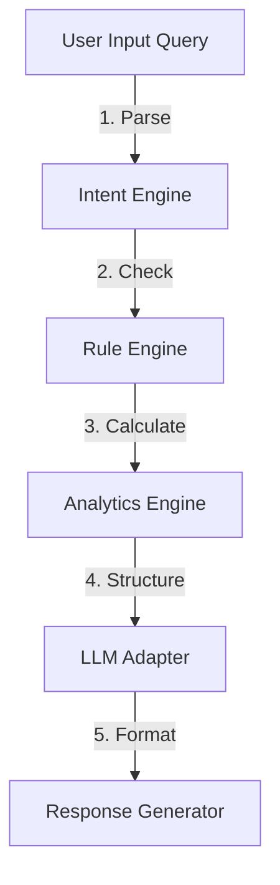

# Architecture Design — AI Analytics Copilot

This document outlines the decoupled intelligence layer of the **AI Analytics Copilot** in DataSaaS Pro.

---

## 1. Five-Tier Copilot Pipeline

To prevent hallucinations, support offline operations, and remain compatible with future LLMs, we implement the following 5 decoupled layers:

### A. Intent Engine
Classifies the user query's semantic intent into one of the following classes:
* `ANOMALY`: Queries for unusual values or outliers.
* `ML_RECOMMENDATION`: Queries for ML model choices or training recommendations.
* `VISUAL`: Requests for charts, heatmaps, or graphs.
* `FACT_QUERY`: Natural language fact lookups ( Bihar vs Delhi, top 10 categories).
* `CLEANING_RECOM`: Requests for column cleaning suggestions.
* `CHAT`: Casual conversation.

### B. Rule Engine
Enforces constraints to prevent bad operations or SQL injection:
* Validates target column names against the active dataset schema.
* Checks data type compatibility.

### C. Analytics Engine
Performs actual, deterministic mathematical computations on the active Polars dataset first. The AI receives absolute data truths before answering.

### D. LLM Adapter
Abstracts the LLM API calls. Features templates for offline fallback when no API key is set, and supports plugging in OpenAI GPT, Gemini, Claude, or local Ollama configurations.

### E. Response Generator
Translates data facts and LLM text into CEO-ready executive summaries (AI Story) and binds visual assets (chart specifications) for the UI.
