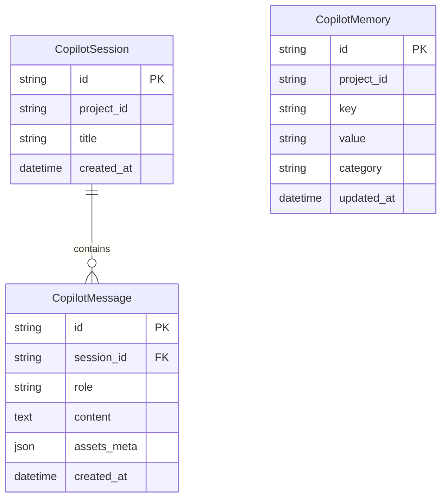

# Database Schema — AI Copilot Sessions & Memory

This document maps the database schemas and relationships for the **AI Analytics Copilot**.

---

## 1. Entity Relationships

---

## 2. Table Column Schema Details

### A. `copilot_sessions`
Tracks active discussion channels in a project.
* `id` (VARCHAR, Primary Key): Unique session ID.
* `project_id` (VARCHAR, Index): Links chat to project workspace.
* `title` (VARCHAR): Discussion heading.
* `created_at` (DATETIME): Timestamp.

### B. `copilot_messages`
Stores message logs for each session.
* `id` (VARCHAR, Primary Key).
* `session_id` (VARCHAR, Foreign Key -> `copilot_sessions.id`).
* `role` (VARCHAR): Sender role (`user` or `assistant`).
* `content` (TEXT): Natural language response text.
* `assets_meta` (JSON): Layout attributes for rendering interactive tables or charts in the chat bubble.

### C. `copilot_memories`
Maintains long-term contextual state variables.
* `id` (VARCHAR, Primary Key).
* `project_id` (VARCHAR, Index).
* `key` (VARCHAR): Memory identifier (e.g. `last_target_column`).
* `value` (VARCHAR): Stored state details.
* `category` (VARCHAR): Memory type category (e.g. `last_metric`).
