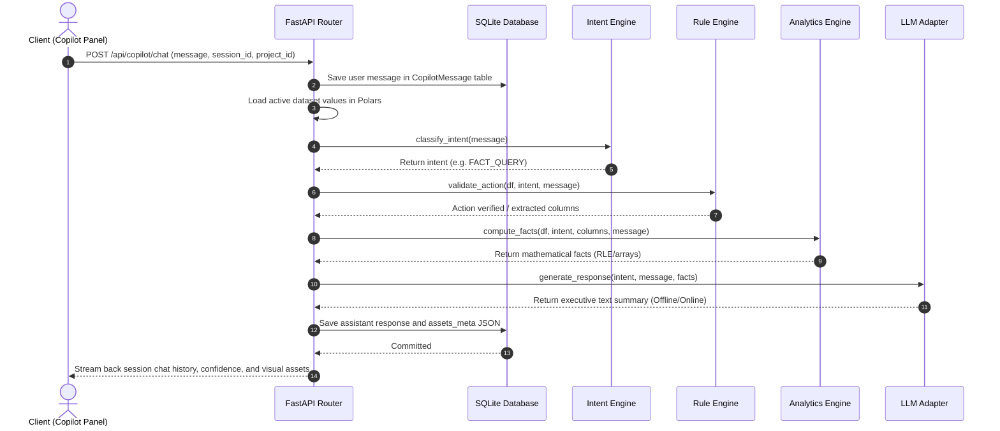

# Sequence Diagram — AI Copilot Conversation flow

This document details the sequence of processing when a user posts a conversational query.

---

```mermaid
sequenceDiagram
    autonumber
    actor User as Client (Copilot Panel)
    participant API as FastAPI Router
    participant DB as SQLite Database
    participant Intent as Intent Engine
    participant Rules as Rule Engine
    participant Analytics as Analytics Engine
    participant Adapter as LLM Adapter

    User->>API: POST /api/copilot/chat (message, session_id, project_id)
    API->>DB: Save user message in CopilotMessage table
    API->>API: Load active dataset values in Polars
    API->>Intent: classify_intent(message)
    Intent-->>API: Return intent (e.g. FACT_QUERY)
    API->>Rules: validate_action(df, intent, message)
    Rules-->>API: Action verified / extracted columns
    API->>Analytics: compute_facts(df, intent, columns, message)
    Analytics-->>API: Return mathematical facts (RLE/arrays)
    API->>Adapter: generate_response(intent, message, facts)
    Adapter-->>API: Return executive text summary (Offline/Online)
    API->>DB: Save assistant response and assets_meta JSON
    DB-->>API: Committed
    API-->>User: Stream back session chat history, confidence, and visual assets
```
