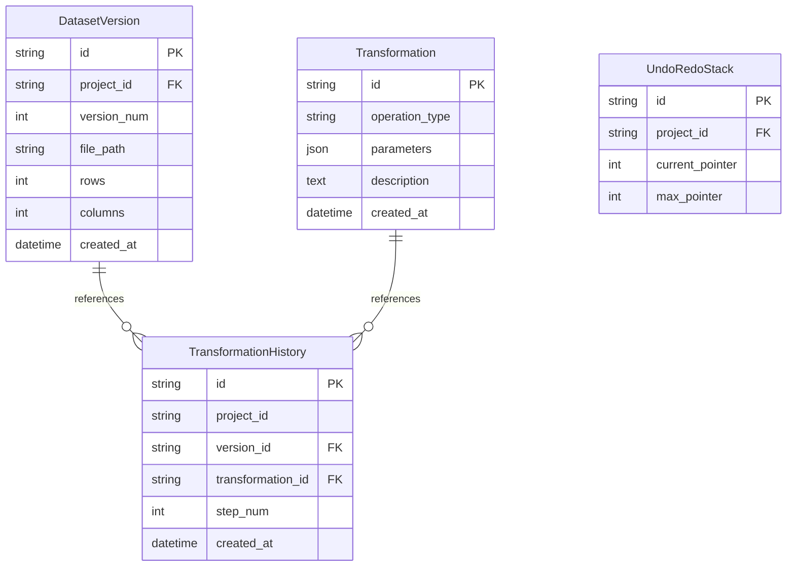

# Database Schema — Data Preparation Studio

This document explains the entity relationships and table schemas mapping the **Intelligent Data Preparation Studio**.

---

## 1. Entity Relationship (ER) Summary

---

## 2. Table Column Schema Explanations

### A. `dataset_versions`
Stores metadata pointers for every intermediate Parquet output file.
* `id` (VARCHAR, Primary Key): Unique version identifier.
* `project_id` (VARCHAR, Index): Reference to project workspace.
* `version_num` (INTEGER): Sequence version number (starts at 1).
* `file_path` (VARCHAR): Absolute disk path storing Parquet values.
* `rows` (INTEGER): Total row count.
* `columns` (INTEGER): Total column count.
* `created_at` (DATETIME): Timestamp.

### B. `transformations`
Details atomic transformations.
* `id` (VARCHAR, Primary Key).
* `operation_type` (VARCHAR): The type category name (e.g. `cast_type`).
* `parameters` (JSON): The configuration details (e.g. columns list).
* `description` (TEXT): Natural descriptive summary of changes.

### C. `transformation_histories`
Maps applied sequence steps to version outputs.
* `version_id` (VARCHAR, Foreign Key -> `dataset_versions.id`).
* `transformation_id` (VARCHAR, Foreign Key -> `transformations.id`).
* `step_num` (INTEGER): Pointer order alignment.

### D. `undo_redo_stacks`
Allows undo/redo point calculations in active workspace sessions.
* `project_id` (VARCHAR, Unique Index).
* `current_pointer` (INTEGER): Points to the version step currently selected.
* `max_pointer` (INTEGER): Points to the latest version step computed.
