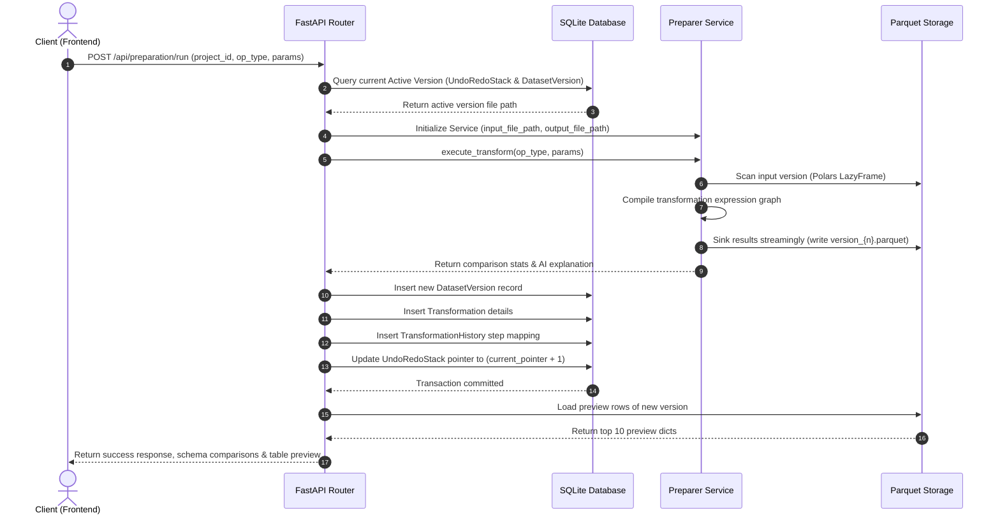

# Sequence Diagram — Data Preparation Request Flow

This document details the sequence of execution when a client triggers a data preparation transformation step.

---

```mermaid
sequence_diagram
sequenceLine: 1
sequenceLine: 2
sequenceLine: 3
sequenceLine: 4
sequenceLine: 5
sequenceLine: 6
sequenceLine: 7
sequenceLine: 8
sequenceLine: 9
sequenceLine: 10
sequenceLine: 11
sequenceLine: 12
sequenceLine: 13
sequenceLine: 14
sequenceLine: 15
sequenceLine: 16
sequenceLine: 17
sequenceLine: 18
sequenceLine: 19
sequenceLine: 20
sequenceLine: 21
sequenceLine: 22
sequenceLine: 23
sequenceLine: 24
sequenceLine: 25
```


