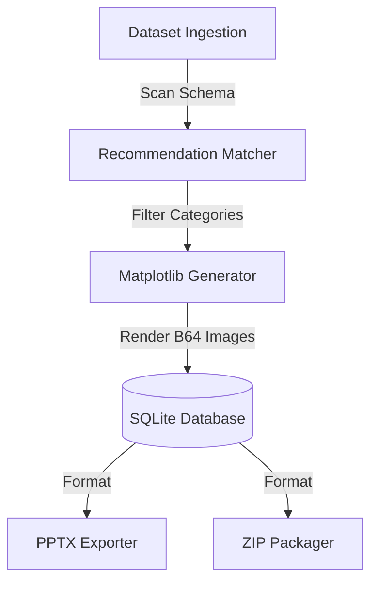

# Architecture Design — AI Visualization Engine

This document details the modular visual compilation layer of the **AI Visualization Intelligence Engine** in DataSaaS Pro.

---

## 1. Modular Processing Workflow

The Visualization Engine scans dataset column properties to match, score, and build appropriate visualizations:

### A. Dynamic Category Classifications
We divide visualizations into 6 discrete categories:
1. **Business**: Segment contributions (Waterfalls) and executive value cards (KPIs).
2. **Statistical**: Quartiles spread (Boxplots) and continuous frequency densities (Histograms).
3. **Machine Learning**: Model impact weightings (SHAP importance).
4. **Correlation**: Heatmaps mapping linear coefficients.
5. **Time Series**: Temporal lines with rolling averages.
6. **Geographic & Network**: Map representations and flow matrices.

### B. In-Memory Image Rendering
Rather than executing slow client-side canvas calls, the engine uses **Matplotlib (Agg backend)** on the server side to compile charts safely in thread-safe contexts, producing PNG and SVG base64 binary strings.

### C. PowerPoint & Zip Assembler
* **PowerPoint Exporter**: Integrates `python-pptx` to construct presentation templates, placing visual plots on the left-side section and business value metrics (stars, narratives, confidence) on the right.
* **ZIP Packager**: Assembles standalone dashboards (`dashboard.html` embedding the base64 charts) and separate PNG/SVG file directories.
