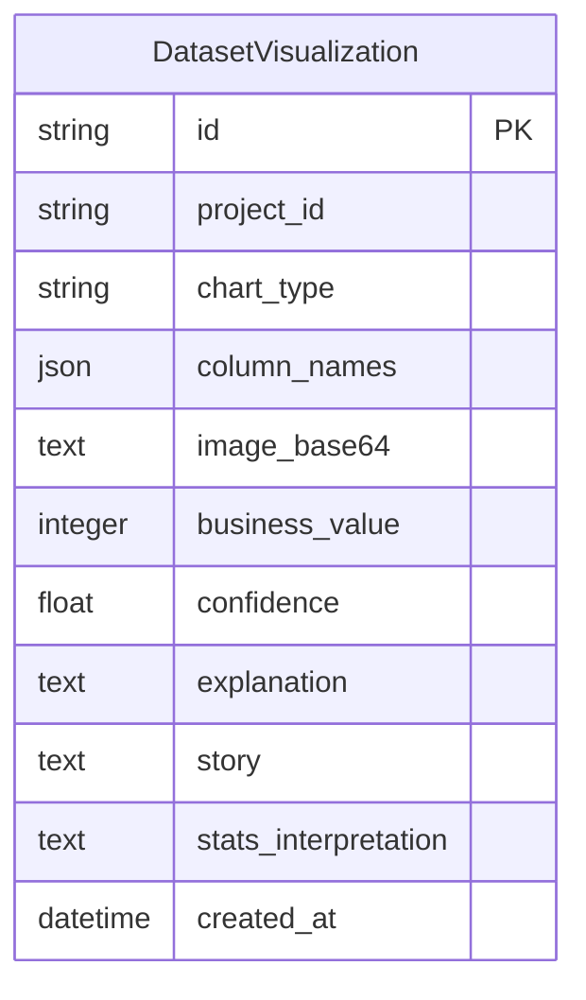

# Database Schema — AI Visualizations Storage

This document details the database schemas and relationships for the **AI Visualization Intelligence Engine**.

---

## 1. Entity Relationships

---

## 2. Table Column Schema Details

### `dataset_visualizations`
Stores generated visual assets and narrative properties.
* `id` (VARCHAR, Primary Key): Unique UUID.
* `project_id` (VARCHAR, Index): Links visual data to the project workspace.
* `chart_type` (VARCHAR): Visual category identifier (e.g. `sales_trend`).
* `column_names` (JSON): Ordered list of column names used in the chart coordinates.
* `image_base64` (TEXT): High-density base64 encoded PNG chart data.
* `business_value` (INTEGER): Rating value (1 to 5) indicating executive utility.
* `confidence` (FLOAT): Score indicating statistical clarity (0% to 100%).
* `explanation` (TEXT): Technical plot description.
* `story` (TEXT): Business narrative explaining variance or trends.
* `stats_interpretation` (TEXT): Statistical context explaining observations.
* `created_at` (DATETIME): Timestamp.
