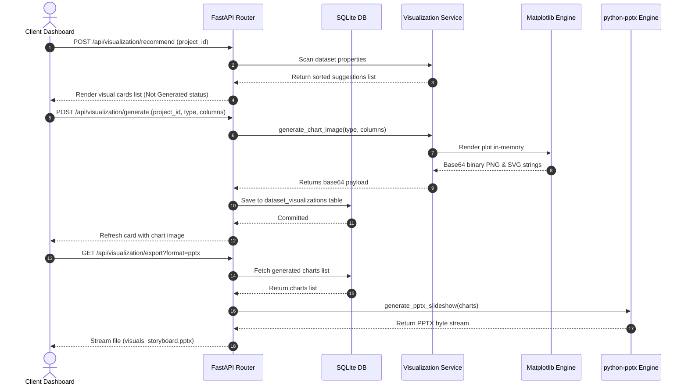

# Sequence Diagram — AI Visualization Compilation

This sequence diagram outlines the processing steps for plotting recommendations and PPTX compilation.

---

```mermaid
sequenceDiagram
    autonumber
    actor User as Client Dashboard
    participant API as FastAPI Router
    participant DB as SQLite DB
    participant Engine as Visualization Service
    participant Matplotlib as Matplotlib Engine
    participant PPTX as python-pptx Engine

    User->>API: POST /api/visualization/recommend (project_id)
    API->>Engine: Scan dataset properties
    Engine-->>API: Return sorted suggestions list
    API-->>User: Render visual cards list (Not Generated status)

    User->>API: POST /api/visualization/generate (project_id, type, columns)
    API->>Engine: generate_chart_image(type, columns)
    Engine->>Matplotlib: Render plot in-memory
    Matplotlib-->>Engine: Base64 binary PNG & SVG strings
    Engine-->>API: Returns base64 payload
    API->>DB: Save to dataset_visualizations table
    DB-->>API: Committed
    API-->>User: Refresh card with chart image

    User->>API: GET /api/visualization/export?format=pptx
    API->>DB: Fetch generated charts list
    DB-->>API: Return charts list
    API->>PPTX: generate_pptx_slideshow(charts)
    PPTX-->>API: Return PPTX byte stream
    API-->>User: Stream file (visuals_storyboard.pptx)
```
